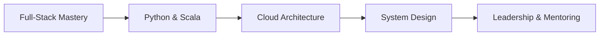

<div align="center">
  
</div>

<div align="center">
  
</div>

<div align="center">
  <a href="https://github.com/evinaa21">
    
  </a>
  <a href="https://github.com/evinaa21?tab=followers">
    
  </a>
  <a href="https://github.com/evinaa21?tab=repositories">
    
  </a>
</div>

---

<table>
<tr>
<td width="50%">

### 👋 Welcome to my digital space!

I'm **Evina**, a passionate full-stack developer from Albania 🇦🇱, dedicated to crafting exceptional digital experiences. Currently diving deep into **hotel management systems** while expanding my expertise in **Python** and **Scala**.

```yaml
name: Evina Tershalla
location: Albania 🇦🇱
role: Full-Stack Developer
current_focus: 
  - Hotel Management Systems
  - User Experience Design
learning: [Python, Scala, Cloud Architecture]
interests: [Web Development, Mobile Apps, System Design]
```

**🎯 What I'm working on:**
- 🏨 **CheckMate** - Next-gen hotel management platform
- 🌐 **Personal Portfolio** - Showcasing my journey
- 📚 **Open Source** - Contributing to the community

</td>
<td width="50%">


</td>
</tr>
</table>

---

## 🚀 Tech Stack & Tools

<div align="center">

### Frontend Development


### Backend & Database


### Mobile Development


### Tools & Platforms


</div>

<details>
<summary>📊 <strong>View Detailed Skills</strong></summary>

<br>

| Category | Technologies |
|----------|-------------|
| **Frontend** | HTML5, CSS3, JavaScript (ES6+), React, Vue.js, Angular |
| **Backend** | Node.js, PHP, RESTful APIs |
| **Database** | MySQL, Firebase |
| **Mobile** | Flutter, Dart, Android Development |
| **DevOps** | Git, Linux, Version Control |
| **Design** | Figma, UI/UX Principles |
| **Learning** | Python, Scala, Cloud Technologies |

</details>

---

## 📈 GitHub Statistics

<div align="center">
  
  
</div>

<div align="center">
  
</div>

---

## 🏆 Featured Projects

<div align="center">
<table>
<tr>
<td width="50%">

### 🏨 CheckMate
**Hotel Management System**

A comprehensive platform designed to streamline hotel operations with modern web technologies.

**Tech Stack:** React, Node.js, MySQL  
**Status:** In Development  

</td>
<td width="50%">

### 🌐 Portfolio Website
**Personal Showcase**

A responsive portfolio showcasing my projects and skills with modern design principles.

**Tech Stack:** HTML, CSS, JavaScript  
**Live:** [evinatershalla.netlify.app](https://evinatershalla.netlify.app/)

</td>
</tr>
</table>
</div>

---

## 🌟 Let's Connect & Collaborate

<div align="center">

[](https://www.linkedin.com/in/evina-tershalla/)
[](https://evinatershalla.netlify.app/)
[](mailto:evina.tershalla.se@gmail.com)

</div>

<div align="center">

### 💼 Open for Opportunities

I'm passionate about creating impactful solutions and always interested in discussing:
- **Freelance Projects** - Web & Mobile Development
- **Collaboration** - Open Source Contributions
- **Innovation** - Exploring new technologies together

</div>

---

## 🎯 Current Goals & Learning Path



<div align="center">

| 🎯 2025 Goals | 📊 Progress |
|---------------|-------------|
| Master Python & Scala | 🟩🟩🟩⬜⬜ 60% |
| Complete CheckMate Project | 🟩🟩🟩🟩⬜ 80% |
| Contribute to Open Source | 🟩🟩⬜⬜⬜ 40% |
| Build Mobile Applications | 🟩🟩🟩⬜⬜ 60% |

</div>

---

## 📊 Contribution Activity

<div align="center">
  
</div>

---

## 🎨 Fun Facts & Interests

<div align="center">

| 🎯 Quick Facts | 💭 Philosophy |
|---------------|---------------|
| 🏠 Based in Albania | *"Clean code always looks like it was written by someone who cares"* |
| 💻 1 Year of Coding | *"Every problem is an opportunity to learn something new"* |
| 🎮 Gamer & Tech Enthusiast | *"The best code is the one that solves real problems"* |
| 📚 Continuous Learner | *"Innovation happens when creativity meets functionality"* |

</div>

---

<div align="center">

###  Ready to build something amazing?

*Whether you have a project in mind, want to collaborate, or just want to chat about technology,*  
*I'm always excited to connect with fellow developers and innovators!*

**Let's turn ideas into reality** ✨

</div>

---

<div align="center">
  
</div>

<div align="center">
  <sub>⚡ Powered by passion, fueled by coffee, driven by curiosity ⚡</sub>
</div>
