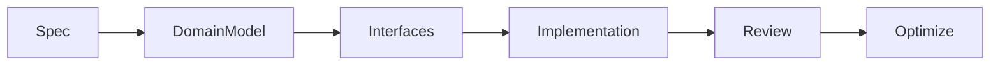

<!-- HEADER -->
<div align="center">
  


<br/>

<a href="https://evinatershalla.netlify.app/">
  
</a>
<a href="mailto:evina.tershalla.se@gmail.com">
  
</a>
<a href="https://www.linkedin.com/in/evina-tershalla/">
  
</a>
<a href="https://github.com/evinaa21">
  
</a>

</div>

---

<!-- QUICK GRID -->
<div align="center">
<table>
<tr>
<td width="33%">

<strong>Focus</strong><br/>
API Design · Data Flow · UX Consistency

</td>
<td width="33%">

<strong>Core Stack</strong><br/>
React · Node.js · PHP · Flutter · SQL

</td>
<td width="33%">

<strong>In Progress</strong><br/>
Python · Scala · Cloud Patterns

</td>
</tr>
</table>
</div>

---

### Profile
Full-stack engineer building scalable, maintainable, and performance-focused applications. Balanced attention to domain modeling, API clarity, and interface precision. Strong preference for predictable structures, measured abstraction, and iterative refinement.

```javascript
const profile = {
  name: "Evina Tershalla",
  role: "Full-Stack Developer",
  location: "Albania",
  stack: {
    frontend: ["React", "Vue", "Angular", "TypeScript"],
    backend: ["Node.js", "PHP", "MySQL", "Firebase"],
    mobile: ["Flutter", "Dart"]
  },
  learning: ["Python", "Scala", "Cloud Architecture"],
  principles: ["Clarity", "Consistency", "Scalability", "Measured abstraction"]
};
```

---

### Architecture & Practice

```text
Design Priorities:
1. Deterministic data flow
2. Cohesive module boundaries
3. Reusable UI components
4. Explicit error surfaces
5. Observability readiness
```


```mermaid
flowchart LR
Spec --> DomainModel --> Interfaces --> Implementation --> Review --> Optimize
```

---

### Tech Matrix

| Layer | Tools |
|-------|------|
| Frontend | React · Vue · Angular · TypeScript · State Patterns |
| Backend | Node.js (Express) · PHP · REST · AuthZ/AuthN · MySQL · Firebase |
| Mobile | Flutter · Dart |
| Quality | Modularization · Linting · Incremental Tests |
| Ops / Infra | Basic CI/CD · Environment Config · Structured Logging |
| Workflow | Git (feature branches) · Conventional Commits · Component Libraries |

---

### Competency Snapshot
```text
Frontend Architecture  ████████▓░
Design Systems / UI    ███████░░░
Backend API Design     ████████░░
Database Modeling      ███████░░░
Mobile (Flutter)       ██████░░░░
Cloud Foundations       █████░░░░░
```

---

### Featured Work

| Project | Domain | Highlights |
|---------|--------|-----------|
| CheckMate | Hospitality Ops | Role-based modules, booking flows, extensible API |
| LearnPals | EdTech | Quiz engine, modular content model |
| Portfolio Site | Personal | Lightweight build, performance-focused |
| Echoes Of Today | Publishing | Section layout + structured routing |
| Dentaly | Practice Mgmt | Scheduling + patient pipeline fundamentals |

---

### Metrics & Activity

<div align="center">
  


<br/>


</div>

---

### 2025 Targets

| Goal | Progress | Outcome |
|------|----------|---------|
| Launch CheckMate | █████████░ 90% | Full release & deployment |
| Python + Scala Depth | ███████░░░ 75% | Broader backend + data workflows |
| UI/UX Certification | ██████░░░░ 60% | Formal design reinforcement |
| Open Source | █████░░░░░ 55% | Sustained collaboration |
| Cloud Architecture | ████░░░░░░ 40% | Scaling + resilience patterns |

---

### Workflow Preferences

```yaml
process:
  planning: lightweight spec -> refinement
  branching: feature/{scope}
  commits: conventional
  reviews: function + boundary clarity
  testing: incremental + behavior-focused
  delivery: staged
```

---

<details>
<summary><strong>System Notes (Example Pattern)</strong></summary>

```text
API Versioning: URI + change log
Error Model: consistent shape { code, message, context }
Auth: role + capability mapping
UI Components: atomic + layout + domain composites
Data Layers: DTO -> validation -> persistence
```
</details>

---

### Contact
Portfolio: https://evinatershalla.netlify.app  
Email: evina.tershalla.se@gmail.com  
LinkedIn: /in/evina-tershalla  

<div align="center">
  
<img src="https://capsule-render.vercel.app/api?type=wave&height=110&color=0:0F172A,50:1E293B,100:0F172A&section=footer&text=—%20Consistent%20Progress%20—&fontSize=18&fontColor=
