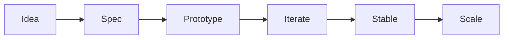

<!-- TITLE / HEADER -->
<div align="center">
  
<h1 style="margin-bottom:4px;">Evina Tershalla</h1>
  
<b>Full-Stack Developer · Web & Mobile Engineering · Scalable Systems</b><br/>
<sub>Albania · Building reliable software with a design mindset</sub>

<hr width="60%"/>

<!-- QUICK LINKS -->
<a href="https://evinatershalla.netlify.app/">Portfolio</a> • 
<a href="mailto:evina.tershalla.se@gmail.com">Email</a> • 
<a href="https://www.linkedin.com/in/evina-tershalla/">LinkedIn</a> • 
<a href="https://github.com/evinaa21">GitHub</a>

</div>

<!-- SUMMARY BANNER -->
<div align="center">
  
<table>
<tr>
<td align="center" width="33%">
  
<strong>Focus</strong><br/>
API Architecture · UI Engineering · System Design
  
</td>
<td align="center" width="33%">
  
<strong>Stack Core</strong><br/>
React · Node.js · PHP · Flutter · SQL
  
</td>
<td align="center" width="33%">
  
<strong>Currently Exploring</strong><br/>
Python · Scala · Cloud (Scalability & Resilience)
  
</td>
</tr>
</table>

</div>

---

### 🔧 Tech Stack

| Layer | Tools |
|-------|-------|
| Frontend | React · Vue · Angular · TypeScript · CSS Modules |
| Backend | Node.js (Express) · PHP · REST · Auth · MySQL · Firebase |
| Mobile | Flutter · Dart |
| Dev Practices | Clean Architecture · API Design · Component Libraries |
| Tooling | Git · VS Code · Figma · Linux · CI/CD (basic) |

---

### 🗂 Featured Work

| Project | Area | Notes |
|---------|------|-------|
| CheckMate | Hotel Management System | Operational workflows, modular backend, multi-role access |
| LearnPals | Learning App | Interactive study flow, reusable quiz engine |
| Portfolio Site | Personal Brand | Performance-focused, responsive layout system |
| Echoes Of Today | News Platform | Content delivery + structured sections |
| Dentaly | Clinic Management | Appointment + patient flow foundation |

---

### 📈 Metrics & Activity

<div align="center">

<a href="#"></a>
<a href="#"></a><br/>
<a href="#"></a>

</div>

---

### 🧭 2025 Targets

| Goal | Progress | Description |
|------|----------|-------------|
| Launch CheckMate | █████████░ 90% | End-to-end release & deployment |
| Advance Python & Scala | ███████░░░ 75% | Broader backend + data workflows |
| UI/UX Certification | ██████░░░░ 60% | Formalizing design approach |
| Open Source Contributions | █████░░░░░ 55% | Code + issue collaboration |
| Cloud Architecture | ████░░░░░░ 40% | Scaling + fault tolerance patterns |

---

### 💼 Approach

```text
Principles:
• Build for clarity first
• Abstract only when justified
• Optimize after correctness
• Consistent naming > clever hacks
• Interfaces should guide usage
```


```mermaid
flowchart LR
Idea --> Spec --> Prototype --> Iterate --> Stable --> Scale
```

---

### 🧪 Tooling Preferences

```yaml
editor: VS Code
commit_style: conventional
testing: incremental + behavior-focused
branching: feature-first
design_hand-off: components + tokens
```

---

### 📬 Contact

If you have a project, collaboration idea, or engineering challenge worth discussing:

- Portfolio: https://evinatershalla.netlify.app  
- Email: evina.tershalla.se@gmail.com  
- LinkedIn: /in/evina-tershalla  

---

<div align="center">
<sub>Consistent. Focused.
